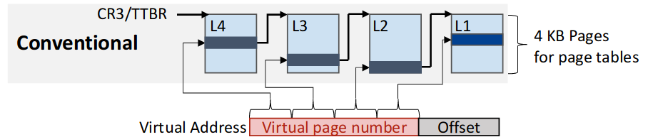
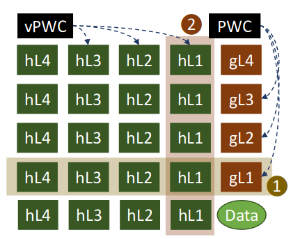
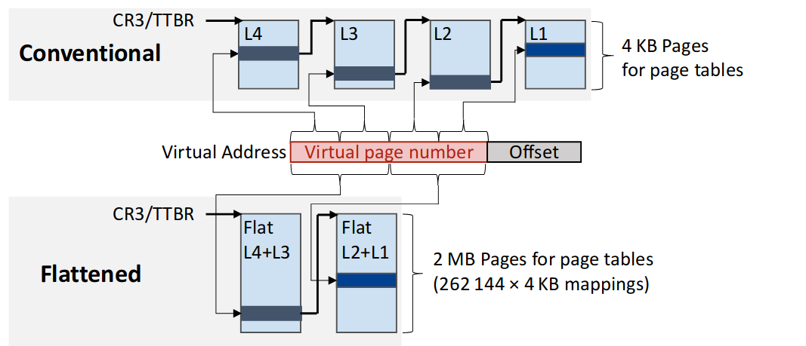
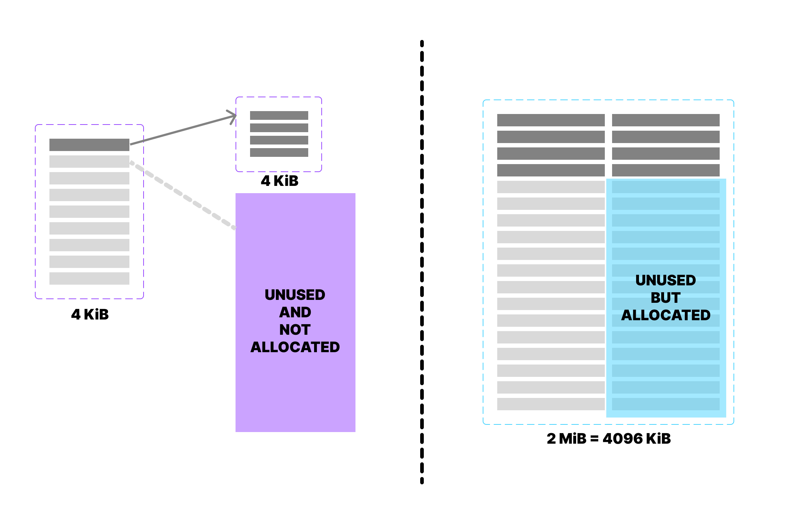

> Drafted by [zincentimeter](https://t.me/zincentimeter)

> Reviewed by [Canary pwn](https://t.me/moe_canary) and [Matt Jiang](https://t.me/sigsyster) [^author_order]

## Summary

Page tables with multiple levels give a big range of memory mapping.  Yet this design makes memory accesses slower with more accesses of page table entries.  In a modern 4-level page tables, walking through all the page tables may cause 5 times more memory accesses in worst case.

Based on this facts, this paper shortens page table to reduce number of main memory accesses and keeps page table entries in the CPU cache for quicker page walks.  (Quoted from [the poster](https://iamchanghyunpark.github.io/slides/ASPLOS22-FlattenPrioritize-Poster.pdf))  The authors claim to yields 9.2% performance gain.

The contribution of this paper is a scalable solution for large memory footprint.  In the exsiting system,  page walk caches buffer the latest translation of each page table level.  However, cache-based solutions are limited by the organisation of caches, and the coverage may get outstripped.  This paper proposes a promising method to reduce memory accesses during translation,  increasing the performance gain aside from outstripped cache overage.

## Background

Memory is managed into multiple pages by operating system.  For a memory access in modern computer system,  processors first accept a virtual address and translate it to physical address by querying the page tables organized by operating system.

### Who's In Charge of Page Tables?

Page tables are managed by operating system, while being assisted by hardware.  The operating system's kernel plays a key role in managing page tables, as it is responsible for allocating and deallocating memory as needed.  Meanwhile, [memory management unit (MMU)](https://en.wikipedia.org/wiki/Memory_management_unit), as a computer hardware unit near CPU, initiates address translation of every access from CPU.  Overall, managing page tables is a complex task that requires coordination between hardware and software components.

### Layout of Page Tables with Multiple Levels

Each page table entry is 8-byte long to store the mapping from virtual address to physical one and other information.  The size of each page table is a memory page,  i.e. 4 KiB.  So,  a 4 KiB page table has only 512 entries[^calc_1],  which only covers 512 memory pages.  So page tables are designed as a tree with multiple levels to cover larger memory range.  A conventional 4-level page table can theoretically translate 68 billion[^calc_2] pages,  i.e. 256 TiB memory[^calc_3].

{:style="display:block; margin-left:auto; margin-right:auto"}

> Figure:  This is a conventional layout for 4-level page table (from [the paper](https://doi.org/10.1145/3503222.3507718))

### Overhead

As page tables are deeper, page walks require more memory accesses,  as page tables are themselves stored in memory.  When a program issue a memory fetch request,  a page walk in translation from virtual address to physical one will trigger 4 memory accesses in worst case.

The number of accesses to memory in one request amplifies to 25 in virtual machine guest.  In this case,  a memory access goes through 4-level translation in guest operating system.  Each level is an memory access in virtual machine host, which results in extra four access for each step in a page walk.

{:style="display:block; margin-left:auto; margin-right:auto"}

> Figure:  This is address translation of memory request in a virtual machine guest (from [the paper](https://doi.org/10.1145/3503222.3507718))

### Page Walk Caches

Page walk caches buffers lookups for some levels of page table.  This component manages to reduce most memory accesses happened during page walks.  The authors admit it in [the paper](https://doi.org/10.1145/3503222.3507718) that "*the benefits from flattening may be smaller as the PWCs [page walk caches] already skip many of the page table accesses*".

Page walk caches take significant effect.  In [the paper](https://doi.org/10.1145/3503222.3507718), page walk caches are credited to make the number of accesses from 24 to "*as low as 3 to 4.8, with an average of 4.4*".

## Design

The authors' proposed design is divided into two parts:  flattening and prioritizing.  Firstly, they flattens the page table to use larger pages and fewer levels.  Then, they mark page table entries in CPU cache and make the replacement policy biased to not evict page table entries during high TLB miss.

### Flattening

Flattening page tables means to combine two levels together.  Before flattening,  each level takes 9-bit[^calc_4] from virtual address as indexes to find next level entry.  After combining two tables into one,  a flattened table indexes with 18-bit.

{:style="display:block; margin-left:auto; margin-right:auto"}

> Figure:  How flattened tables index using virtual address (from [the paper](https://doi.org/10.1145/3503222.3507718))

One problem for flattening is space waste.  Given the fact that each page table is managed by operating system dynamically,  when combining two tables together,  unused entries are also allocated inside the 2 MiB page table.  Therefore, an important question is to choose two levels that will not trigger that much space waste.

{:style="display:block; margin-left:auto; margin-right:auto"}

> Figure:  A description of how bigger page table wastes the space.

The authors choose to flatten the L3+L2 page tables.  Each L4 page table entry has a reach of 512 GiB, so merging L4 with L3 may result in a lot of space waste as programs seldom allocate memory of that large scale.  But the author also states that the choice of which to flatten can be made *on a per-process and per-table basis*.

### Prioritizing

The authors conduct an experiment on a Desktop computer with Intel i7-9700 and a shared 12 MiB last level cache.  A background thread periodically touches the page table the ongoing thread is working on, so that page table entries can stay in CPU caches.  The authors claim to observe a 5% performance gain.  This motivates them to prioritize page table entries to stay when high [TLB](https://en.wikipedia.org/wiki/Translation_lookaside_buffer) misses happen.

To know whether the TLB miss rate is high, they uses performance counter given by processors.  To identify a page table entry, they augments caches with a page table identification bit for each cache line.  To prioritize page table entries, they favor [way partitioning](https://militaryembedded.com/avionics/safety-certification/cache-utilization-safety-critical-multicore-applications),  a technology to make some cache ways fixed for certain applications and will not be accessed by other application.

I believe the authors could have provided more details on how this is done.  They give few descriptions on it.  For example,  they should disclose what performance counters specifically are used by CPU caches to detect high TLB miss rates.

## My Comments on Evaluations

The authors' evaluations are conducted on [gem5](https://gem5.org), a cycle-accurate architecture simulator.  They modified the implementation of CPU cache.  However, their evaluation give a less confident outcome.  The overall performance makes few difference compared to other existing design.  Although the memory accesses breakdown does show the decrease of memory request, but the authors are encouraged to describe more details on how they are completely consistent to be "one" requests per page walk among all benchmarks.  More micro-architecture details, for example, CPU cache miss rates, are required to validate their proposed design.

## Conclusion

This paper gives two proposals to reduce memory accesses during page walk,  flattening the page table and prioritizing page table entries' stay in CPU cache during peak time.  However,  page walk caches has already save the day mostly.  In general,  the effect of optimization over TLB and page walks is so limited.

## Extra Comments

I notice there is [a following work in HPCA 2023,  focusing on the efficiency of page table walk](https://ieeexplore.ieee.org/abstract/document/10071054).  This work gives a deep insight of page walking.

[^calc_1]: `Number of Page table entry = Page Table size / Page Table entry size = 4 KiB / 8 byte = 4 096 byte / 8 byte = 512`
[^calc_2]: `Number of reachable data pages = L4 reach * L3 reach * L2 reach * L1 reach = 512 * 512 * 512 * 512 = 68 719 476 736 `
[^calc_3]: `Reachable Memory  = Number of reachable data pages * Page size = 68 719 476 736 Pages * 4096 Bytes / Page =  281 474 976 710 656 Bytes = 256 TiB`
[^calc_4]: Since `2^9=512`

[^author_order]: In alphabetic order